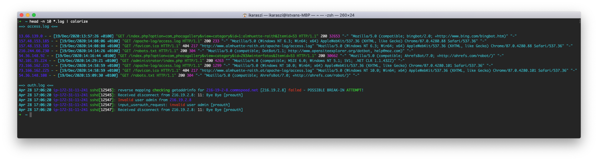

# Colorize

## About

Colorize is a powerful and versatile Perl script to colorize your logs. With support for multiple log formats and customizable color schemes, this tool makes it simple to highlight important information and pinpoint problem areas, while also making the logs more visually appealing.

It was one of the first solutions of this kind and it inspired the development of other similar tools, such as [CCZE](https://github.com/cornet/ccze).

Although the project is not actively maintained, it still works without issues and it can be useful for those who are looking for a similar solution. Whether you're a system administrator monitoring daily logs or a developer debugging a complex application, colorize is an essential tool for anyone who wants to make sense of their log data in a fast and efficient way, while also enjoying the nice look of the colorized output.

### Example Screenshot



It uses coherent colors for every log formats which is pretty cool but you can use your own colors by modifying the configuration file in your home directory (`~/.colorizerc`) or system-wide (`/etc/colorizerc`).

## Installation

### MacOS

Install my tap from [raszi/homebrew-tap][3] with the following command:

```shell
brew tap raszi/tap
```

Then install the formula with:

```shell
brew install raszi/tap/colorize
```

### FreeBSD

It is in the [ports][2], you can install with any preferred way.

### Mageia (Linux)

It is in the [repositories][4], you can install as root with:

```shell
urpmi colorize
```

### Manual

#### Dependencies

This script depends on [Term::ANSIColor][1], so you will need to install it first.

Under Debian GNU/Linux:

```shell
apt-get install perl-modules
```

Gentoo:

```shell
emerge -vta perl-core/Term-ANSIColor
```

Mageia:

```shell
urpmi perl-Term-ANSIColor
```

#### Installing the script

```shell
make install
```

## Usage

Just pipe the logs in the script, and have fun.

## Examples

```shell
cat /var/log/daemon.log | colorize
tail -0f /var/log/daemon.log /var/log/apache/access.log | colorize
colorize < /var/log/messages
```

## Tips

In the TIPS file and in the examples directory.

[1]: http://search.cpan.org/perldoc/Term::ANSIColor
[2]: http://svnweb.freebsd.org/ports/head/sysutils/colorize
[3]: https://github.com/raszi/homebrew-tap
[4]: http://madb.mageia.org/package/show/application/0/name/colorize
